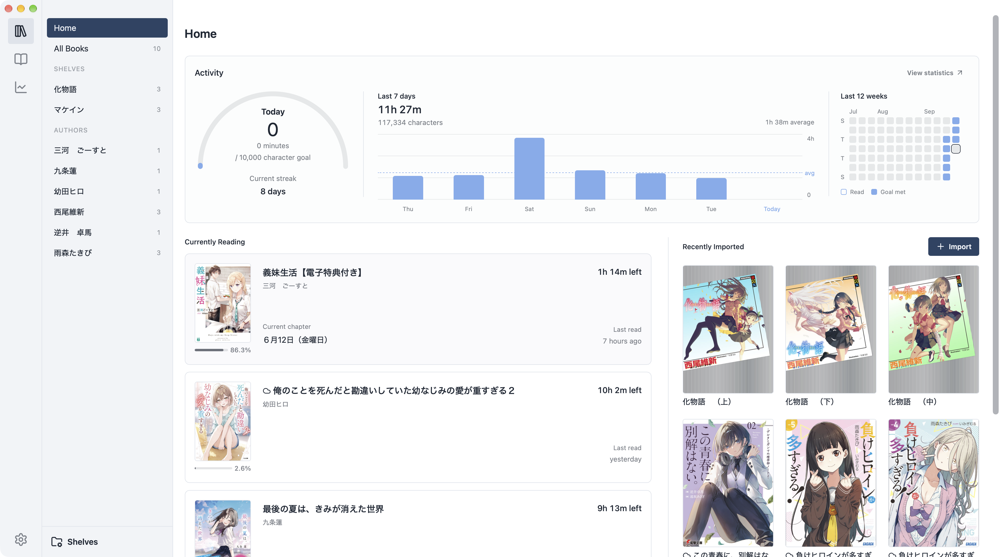
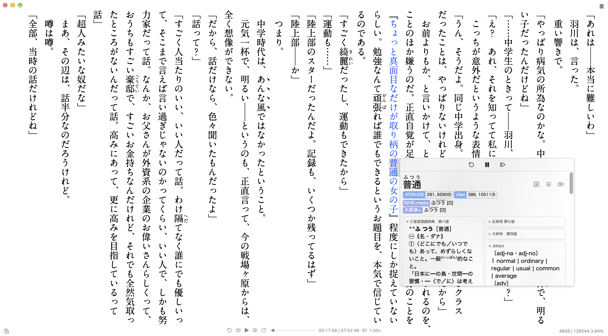
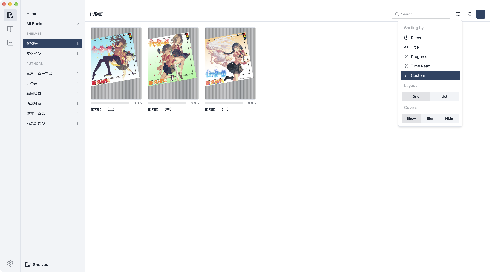
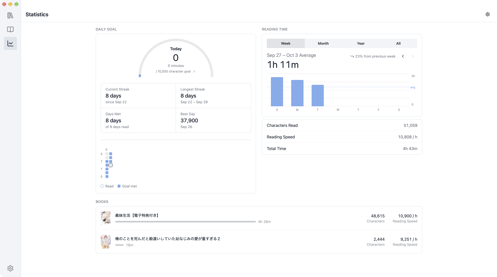
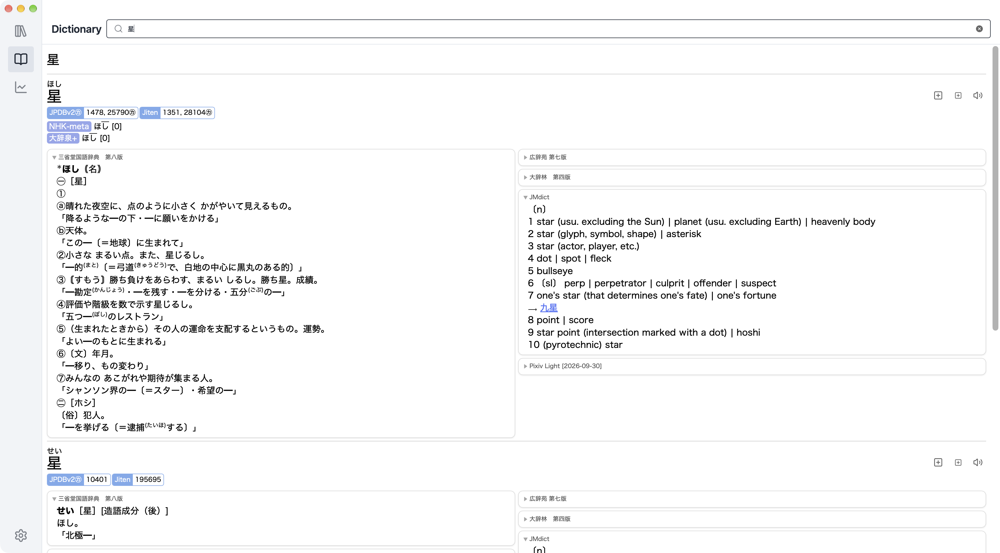

<div align="center">

# Hoshi Reader Desktop


Desktop version of [Hoshi Reader](https://github.com/Manhhao/Hoshi-Reader) and [Hoshi Reader Android](https://github.com/HuangAntimony/Hoshi-Reader-Android), made using Tauri and Svelte.
<p align="center">
    
    
    
    
    
    
</p>

</div>

## Download

[](https://github.com/Manhhao/Hoshi-Reader-Desktop/releases/latest)

Download the `.dmg` for macOS 15+ (Apple Silicon) or the `-setup.exe` for Windows.

## Features

- Vertical (縦書き) and horizontal (横書き) text
- Pop-up dictionary with support for Yomitan term, frequency, pitch and kanji dictionaries
- Audio support for local and remote sources
- Sasayaki (audiobooks)
- Reading statistics
- Mining using AnkiConnect (mainly supports handlebars used by [Lapis](https://github.com/donkuri/lapis#how-to-use-lapis))
- Syncing of books, shelves, bookmarks, highlights and Sasayaki with iOS and Android

## Development

### Prerequisites

- [Rust](https://rustup.rs/) 1.88+
- [Node.js](https://nodejs.org/) 22.12+
- [pnpm](https://pnpm.io/)
- [CMake](https://cmake.org/) 3.24+
- A C++23 compiler
  - macOS: Xcode Command Line Tools
  - Windows: Visual Studio with *Desktop development with C++ workload* and *C++ Clang tools for Windows*

### Run

```sh
pnpm install
pnpm tauri dev
```

### Build

Build release bundles without signing keys:

```sh
pnpm tauri build --no-sign --config '{"bundle":{"createUpdaterArtifacts":false}}'
```

To enable Google Drive sync, set `HOSHI_GOOGLE_CLIENT_ID` and `HOSHI_GOOGLE_CLIENT_SECRET` from your own Google Cloud project before building.

## Contributing

If you're planning on contributing something significant, please open an issue or message me on Discord ([manhhao](https://discord.com/users/278886957667319808)) first.

## Issues

Please open an issue [here](https://github.com/Manhhao/Hoshi-Reader-Desktop/issues) or in the TMW thread.

## Libraries

| Name | License |
| :--- | :--- |
| [hoshidicts-rs](https://github.com/Manhhao/hoshidicts-rs) | GPL-3.0 |
| [Tauri](https://github.com/tauri-apps/tauri) | Apache-2.0 / MIT |
| [Svelte](https://github.com/sveltejs/svelte) | MIT |
| [rbook](https://github.com/DevinSterling/rbook) | Apache-2.0 |
| [mp3lame-encoder](https://github.com/DoumanAsh/mp3lame-encoder) | LGPL-3.0 |
| [Tailwind CSS](https://github.com/tailwindlabs/tailwindcss) | MIT |
| [daisyUI](https://github.com/saadeghi/daisyui) | MIT |
| [Lucide](https://github.com/lucide-icons/lucide) | ISC |

## Attribution

| Name | Description | License |
| :--- | :--- | :--- |
| [Ankiconnect Android](https://github.com/KamWithK/AnkiconnectAndroid) | Implementation for local audio database | GPL-3.0 |
| [Yomitan](https://github.com/yomidevs/yomitan) | Various code from pop-up dictionary | GPL-3.0 |
| [@i_am_onizame](https://x.com/i_am_onizame/status/2074108413546807451) | Artwork | |

## License

Distributed under the GNU General Public License v3.0. See [LICENSE](LICENSE) for more information.
