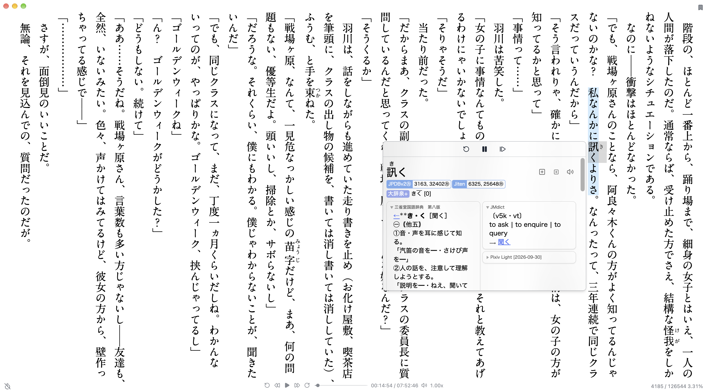

<div align="center">

# Hoshi Reader Desktop


Desktop version of [Hoshi Reader](https://github.com/Manhhao/Hoshi-Reader) and [Hoshi Reader Android](https://github.com/HuangAntimony/Hoshi-Reader-Android) made using Tauri and Svelte.

</div>

<table>
  <tr>
    <td width="33%"></td>
    <td width="33%"></td>
    <td width="33%"></td>
  </tr>
  <tr>
    <td width="33%"></td>
    <td width="33%"></td>
    <td width="33%"></td>
  </tr>
</table>

## Download

Get the latest version from [GitHub Releases](https://github.com/Manhhao/Hoshi-Reader-Desktop/releases/latest).

Requires macOS 15 or newer on Apple Silicon, or Windows 10/11.

## Development

### Prerequisites

- [Rust](https://rustup.rs/) 1.88+
- [Node.js](https://nodejs.org/) 22.12+
- [pnpm](https://pnpm.io/)
- [CMake](https://cmake.org/) 3.24+
- A C++23 compiler
  - macOS: Xcode Command Line Tools
  - Windows: Visual Studio with *Desktop development with C++ workload* and *C++ Clang tools for Windows*

### Run

```sh
pnpm install
pnpm tauri dev
```

## Issues

Please open an issue [here](https://github.com/Manhhao/Hoshi-Reader-Desktop/issues).

## License

Distributed under the GNU General Public License v3.0. See [LICENSE](LICENSE) for more information.
